# Отчёт по модулю 05 — Product Client

**Дисциплина:** CSE5032 «Разработка веб-сервисов»  
**Тема:** Настройка использования Web API с помощью приложения ASP.NET Core  
**НАО «Казахский национальный исследовательский технический университет имени К. И. Сатпаева»** · Институт Автоматики и информационных технологий · Кафедра Программной инженерии  
**Самостоятельная работа студентов с преподавателем** · Зав. кафедры ПИ: Абдолдина Ф. Н. · Экзаменатор: Герцен Е. А.

## Цель работы

Научиться вызывать Web API из приложения ASP.NET Core, использовать `HttpClient` и `IHttpClientFactory`, отправлять HTTP-запросы и обрабатывать ответы сервера.

## Краткий отчёт о выполнении

`ProductClient` — ASP.NET Core MVC-клиент для просмотра и управления товарами. При открытии страницы клиент получает список по `GET /api/products`; формы отправляют создание через POST, изменение через PUT, удаление через DELETE. Отдельная форма позволяет загрузить товар по ID.

В задании не был указан адрес готового API, а предыдущий учебный Product API имеет другую модель. Поэтому в решении есть отдельное приложение `ProductApi` с требуемыми полями `Id`, `Name`, `Description`, `Price`, `Quantity` и маршрутами `/api/products`. Оно нужно для самостоятельного запуска и полного показа сценария. Данные тестового API находятся в памяти: при перезапуске API снова доступны три начальных товара.

Оба приложения созданы на стандартных шаблонах ASP.NET Core: `ProductClient` — MVC, `ProductApi` — Web API с контроллером и Swagger. Клиент не создаёт `HttpClient` для каждого запроса, а получает именованный клиент через `IHttpClientFactory`.

## Ход выполнения

| Шаг | Выполненная работа | Результат |
|---|---|---|
| 1. Шаблоны решения | Созданы отдельные проекты `ProductClient` и `ProductApi` в `ProductClientDemo.sln` | Клиент и Web API запускаются независимо |
| 2. Модель | В проектах добавлен `Product`: `Id`, `Name`, `Description`, `Price`, `Quantity` | API отдаёт три демонстрационных товара; поля совпадают с заданием |
| 3. Регистрация HttpClient | В `ProductClient/Program.cs` добавлен именованный клиент `ProductApi`; адрес читается из конфигурации | BaseAddress задаётся в одном месте, фабрика внедряется через DI |
| 4. Сервис клиента | Созданы `IProductApiService` и `ProductApiService`; сервис получает `IHttpClientFactory` через конструктор | Сервис выполняет GET списка, GET по ID, POST, PUT и DELETE |
| 5. Список и чтение | Сделаны MVC-страница таблицы и форма получения товара по ID | При открытии страницы данные запрашиваются у API; для `404` показывается «Товар не найден.» |
| 6. Создание и изменение | Добавлены форма POST и форма редактирования с текущими данными для PUT | После успеха браузер возвращается к списку, где видны добавленные/изменённые данные |
| 7. Удаление | Добавлена отдельная страница подтверждения и отправка DELETE после нажатия кнопки | Удаление происходит только после явного подтверждения; список обновляется |
| 8. Ошибки API | Проверяются 200, 201, 400, 404, 500; отдельно обрабатываются отсутствие соединения и тайм-аут | Пользователь видит понятное сообщение, клиент не завершается с необработанной ошибкой |
| 9. Проверка и снимки | Пройдена последовательность из задания в браузере | Для каждого действия есть отдельный скриншот; снимки терминалов добавляются отдельно ниже |

## Адрес API

Локальный адрес демонстрационного API: `http://127.0.0.1:5091/`  
Swagger API: `http://127.0.0.1:5091/swagger`  
Адрес клиента задаётся в `ProductClient/appsettings.json`, параметр `ProductApi:BaseAddress`.

Адрес MVC-клиента: `http://127.0.0.1:5092/`.

## Запуск

Нужен .NET 8 SDK. Из корня репозитория откройте два отдельных окна PowerShell.

Окно 1 — запустить Web API:

```powershell
dotnet run --project .\ProductApi\ProductApi.csproj --urls http://127.0.0.1:5091
```

Окно 2 — запустить клиент:

```powershell
dotnet run --project .\ProductClient\ProductClient.csproj --urls http://127.0.0.1:5092
```

Затем открыть `http://127.0.0.1:5092/`. Сначала нужно запустить API: клиент отправляет запросы на указанный BaseAddress.

## HTTP-методы клиента

| Действие | Метод API | Endpoint | Успешный ответ |
|---|---|---|---|
| Показать список товаров | GET | `/api/products` | `200 OK` |
| Получить товар по ID | GET | `/api/products/{id}` | `200 OK`; если нет — `404 Not Found` и «Товар не найден.» |
| Добавить товар | POST | `/api/products` | `201 Created` |
| Изменить название, описание, цену и количество | PUT | `/api/products/{id}` | `200 OK` |
| Удалить после подтверждения | DELETE | `/api/products/{id}` | `200 OK` |

`ProductApiService` проверяет HTTP-статус каждого ответа. Для `400 Bad Request` показывает ошибки валидации API, для `404` — сообщение об отсутствии товара, для `500 Internal Server Error` — сообщение о временной ошибке сервера. Ошибки соединения и тайм-аута также перехватываются. В режиме Development на главной странице доступны отдельные диагностические ссылки, чтобы показать обработку реальных ответов 400 и 500.

## IHttpClientFactory

В `ProductClient/Program.cs` вызывается `AddHttpClient("ProductApi", ...)`; BaseAddress берётся из `ProductApi:BaseAddress` в `appsettings.json`. `ProductApiService` получает `IHttpClientFactory` через конструктор и создаёт настроенный клиент один раз для сервиса с помощью `CreateClient("ProductApi")`. Запросы идут через этот клиент; `new HttpClient()` перед каждым вызовом не создаётся.

## Сценарий демонстрации

1. Запустить `ProductApi`, затем `ProductClient`.
2. Открыть страницу клиента и показать список из Web API.
3. Ввести ID `1`, нажать «Найти» и показать подробности товара.
4. Открыть «Добавить товар», заполнить название, описание, цену и количество; отправить POST.
5. Убедиться, что новый товар появился в таблице.
6. Нажать «Изменить», показать заполненную форму, поменять поля и отправить PUT.
7. Убедиться, что в таблице показаны обновлённые значения.
8. Нажать «Удалить», показать страницу подтверждения и подтвердить DELETE.
9. Убедиться, что товара больше нет в списке.
10. Дополнительно показать сообщение для отсутствующего ID и диагностические ответы 400/500.

## Скриншоты выполнения

Каждый снимок клиента ниже сделан в браузере после выполнения соответствующего действия. Формы и итоговые страницы показаны отдельно, чтобы на защите было видно и ввод данных, и результат API-вызова.

### Список товаров — GET `/api/products`

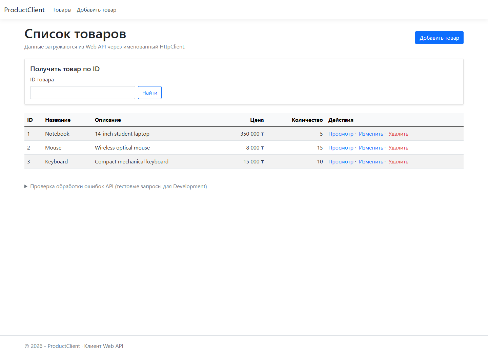

### Получение товара по ID — GET `/api/products/1`

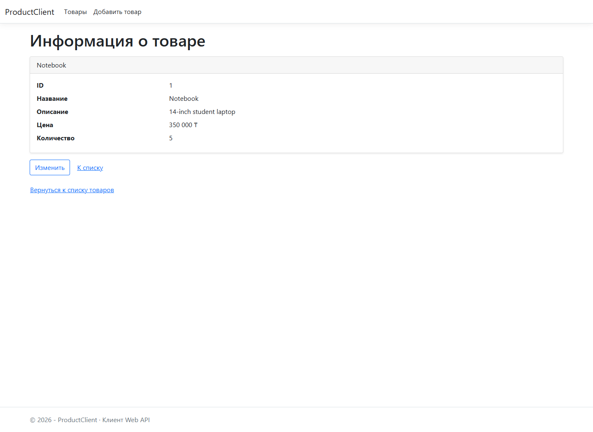

### Ответ для неизвестного ID — HTTP 404

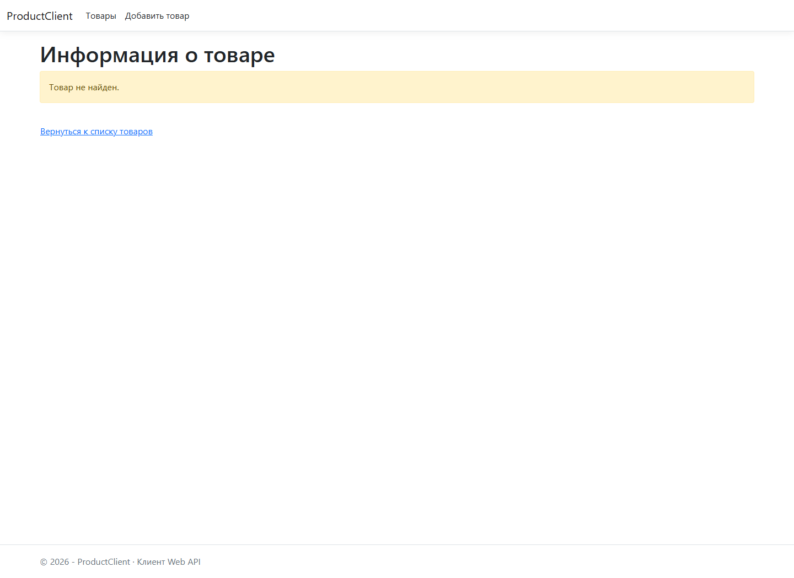

### Добавление товара — форма и POST

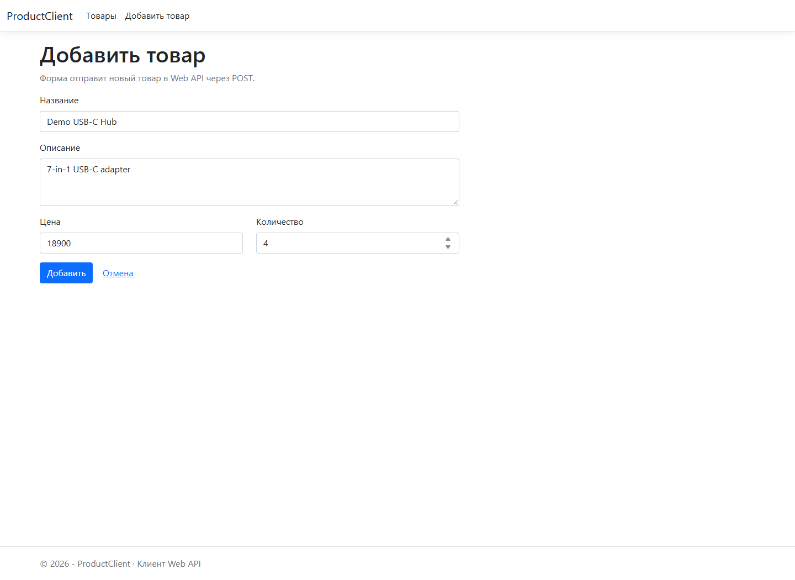

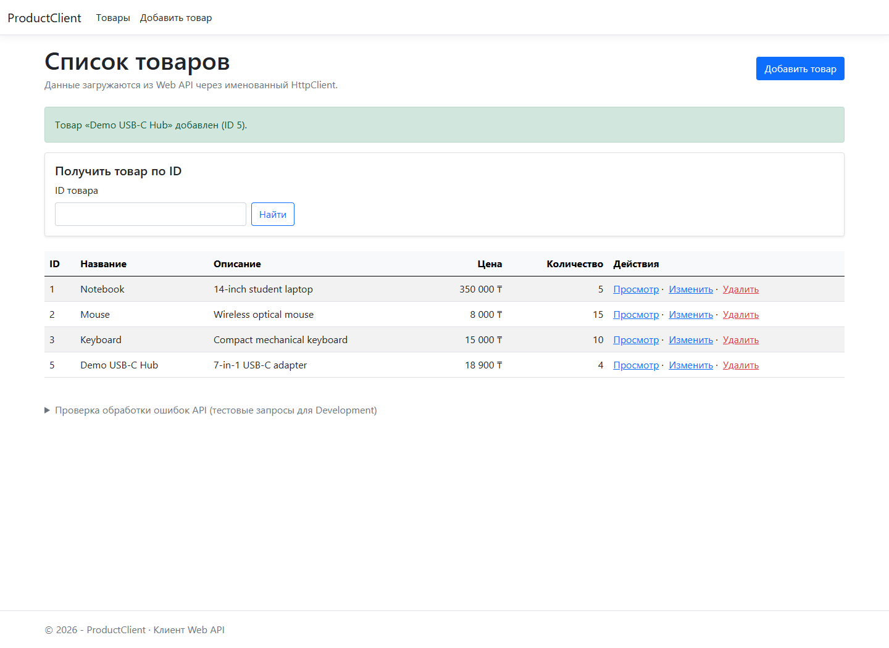

### Изменение товара — форма и PUT

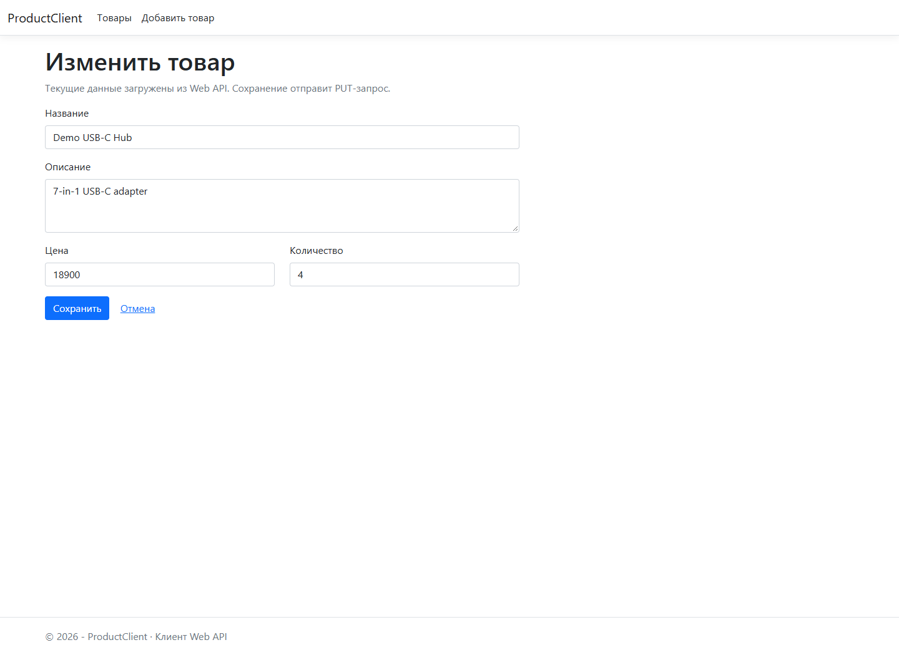

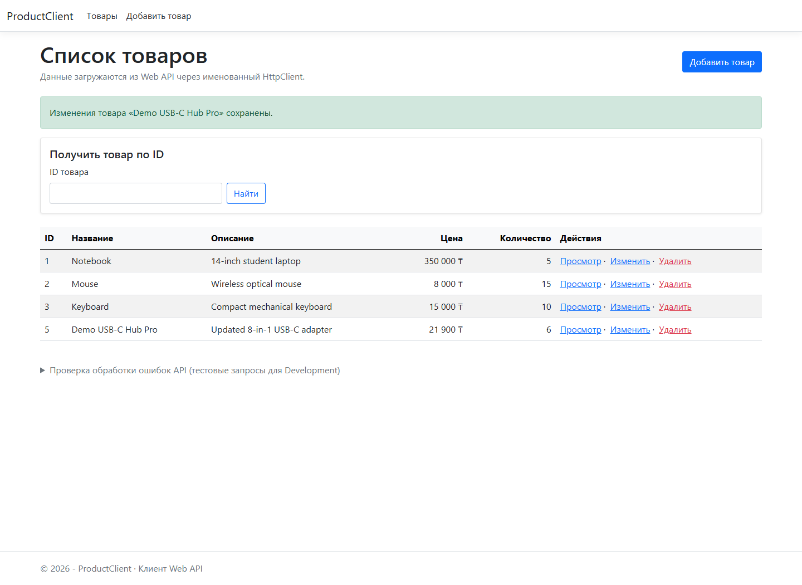

### Удаление товара — подтверждение и DELETE

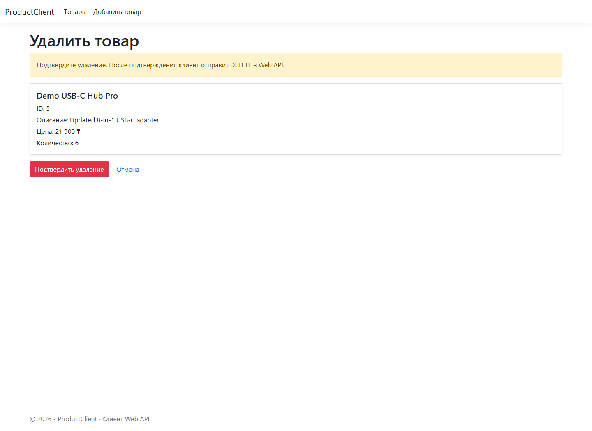

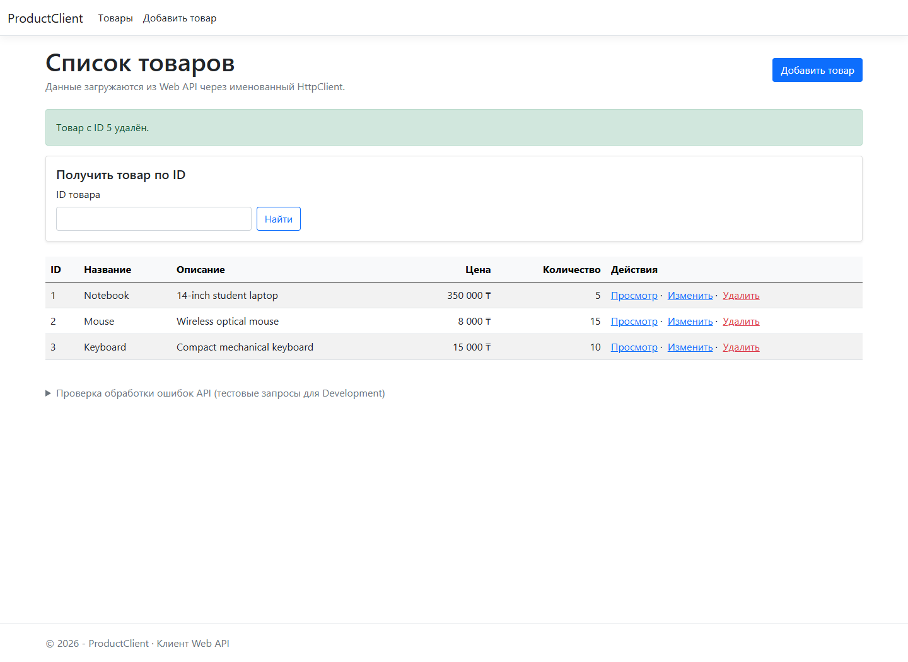

### Обработка ошибок API

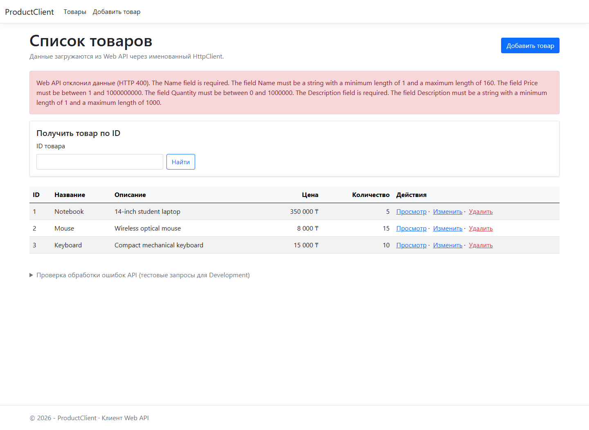

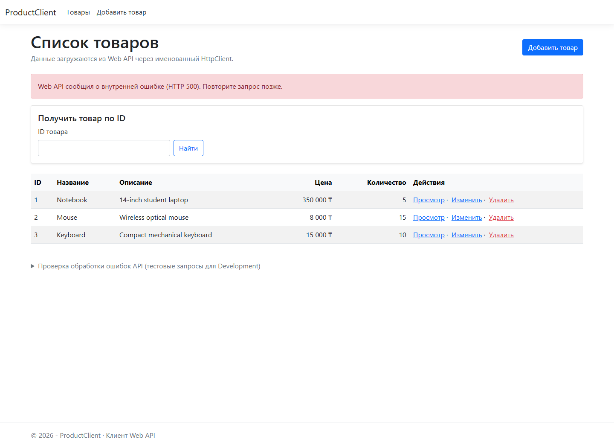

### Консоль Web API и клиента

На одном снимке показаны оба запущенных приложения: слева — Web API с обработанными GET-запросами, справа — клиент с вызовами `ProductApiService`, HTTP-статусами и предупреждением для отсутствующего товара.

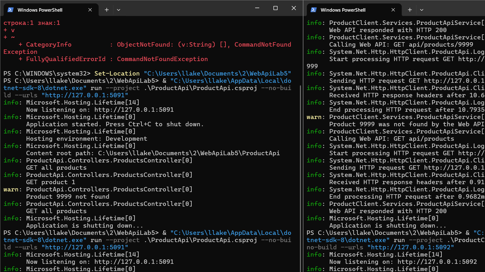

## Вывод

Создано MVC-приложение `ProductClient`, которое использует именованный `HttpClient` через `IHttpClientFactory` и взаимодействует с отдельным Web API. Проверен полный сценарий задания: список, поиск по ID, создание, изменение и удаление товара. Ответы 400, 404 и 500, а также проблемы соединения обрабатываются без аварийного завершения клиента и выводятся пользователю понятным текстом.
